# OCIでOracle AI Database Private Agent Factory 26.7を構築し、最初のAIエージェントを作る

このハンズオンでは、、Oracle AI Database Private Agent Factory（以下、Private Agent Factory）26.7を OCI Marketplaceからデプロイし、リポジトリとしてパブリックなAutonomous AI Database 26aiへ接続します。その後、Data Analisys Agent と Knowledge Agent を順に作成します。

ハンズオンを実施するには、それぞれ専用のOCIコンパートメントが割り当てられているものとします。初回はLab 0から順番に進めてください。環境を維持したまま再実行する場合はLab 2を個別に試せます。

> **課金について：** このハンズオンでは、課金対象になり得るOCIリソースを作成します。終了後は、必要に応じて停止または破棄（終了）してください。なお、停止の場合はストレージ課金は継続します。完全に課金を停止したい場合は破棄（終了）します。


## このハンズオンで作るもの

次の作業を行います。

1. Private Agent FactoryのVMを配置するVCNとパブリック・サブネットを作成する
2. パブリックなAutonomous AI Database 26aiと、Private Agent Factory専用のデータベース・ユーザーを作成する
3. OCI MarketplaceからPrivate Agent Factory 26.7をデプロイする
4. OCI Enterprise AI(Generative AI)のモデルを設定する
5. Data Analysis AgentとKnowledge Agentを作成する

Private Agent Factory 26.7には、3種類のPre-Builtエージェントがあります。
- Knowledge Agent
- Deep Data Research Agent
- Data Analysis Agent

の3つです。このハンズオンでは、Knowledge AgentとData Analysis Agentを使います。

**所要時間の目安：** 120～180分。

**公式ドキュメント**

- [Introduction to Agent Factory — Introduction to Agent Factory](https://docs.oracle.com/en/database/oracle/agent-factory/26.7/paias/introduction.html)
- [Changes in Release 26.7 — New Features and Updates](https://docs.oracle.com/en/database/oracle/agent-factory/26.7/paias/whats-new.html)

## 始める前に

OCIコンソールの基本操作を理解していることを前提とします。割当済みコンパートメントで、次のリソースを作成できる権限が必要です。

- VCN
- コンピュート・インスタンス
- Autonomous AI Database
- Resource Managerスタック
- Marketplaceアプリケーション

OCI Enterprise AI(Generative AI)のモデル呼び出し権限も必要です。

手元には **Webブラウザ** と Private Agent Factory が OCI Enterprise AI(Generative AI)サービスの LLM と 埋め込みモデルにアクセスするための **OCI API署名キー** を用意します（インスタンスプリンシパルの使用も可能ですが本ハンズオン手順では、API署名キーを使用します）。

また、Private Agent Factory をインストールする OCI Compute にアクセスするための **ED25519鍵ペア** も必要です（本ハンズオンでは、ssh 接続は行いませんが、Private Agent Factory の Marketplace からのインストールには、公開鍵が必須入力項目となっています。なお、鍵のタイプは、ED25519のみサポートされています）。ED25519鍵ペアは、Lab 1のMarketplaceデプロイ直前にローカルPCで作成します。

テナンシ管理者が不足する権限を付与する手順は、[Appendix A](#appendix-aハンズオン用リソースを作成せずにoci権限を確認し不足分を付与する)を参照してください。

## 用語集

| 用語 | このハンズオンでの意味 |
|---|---|
| OCI | Oracle Cloud Infrastructure。VCN、VM、ADB、生成AIサービスを配置するクラウド基盤です。 |
| OCID | OCIリソースを一意に識別するOracle Cloud Identifierです。 |
| VCN | OCI上の仮想ネットワークです。今回は、インターネットから接続できるパブリック・サブネットにAgent Factory VMを配置します。 |
| ADB | Autonomous AI Databaseの略称です。Private Agent Factoryのメタデータとハンズオン用データを格納します。 |
| ウォレット | ADBへ接続するためのクライアント資格証明と接続情報をまとめたZIPファイルです。 |
| TNS別名 | ウォレットに含まれるデータベース接続サービス名です。このハンズオンでは末尾が`_tpurgent`の別名を使います。 |
| Resource Managerスタック | Terraform構成をOCIで実行・管理する単位です。MarketplaceからPrivate Agent Factory VMを作成するときに使います。 |
| LLM | Large Language Model（大規模言語モデル）。エージェントの推論や文章生成を担います。 |
| 埋込みモデル | 文書を数値ベクトルに変換し、意味の近い情報を検索できるようにするモデルです。 |
| MCP | Model Context Protocol。エージェントが外部ツールを見つけ、定義された形式で呼び出すためのプロトコルです。 |

## パラメータシート

事前に Excel形式で配布しているパラメータシートをご利用ください。
パラメータシート（Excel）は以下の3つのシートで構成されています。
- 1_事前取得_Prework
- 2_作業中_Decide
- 3_生成値_Generated

各シート共通で、黄色いセルが入力欄。水色のセルは固定値です。


## Lab 0：OCIネットワークとAutonomous AI Databaseを準備する

このLabでは、Marketplaceデプロイに必要な基盤と資格情報を用意します。

### Task 1：VCNとパブリック・サブネットを作成する

VCNウィザードを使うと、パブリックVMに必要なインターネット・ゲートウェイ、ルート表、基本的なセキュリティ・ルールをまとめて作成できます。

1. OCIコンソールで、対象リージョンを選択します。
2. **ネットワーキング > 仮想クラウド・ネットワーク**を開きます。
3. **選択済みフィルター コンパートメント**で割り当てられているコンパートメント名を選択します。
4. **アクション**のプルダウンから**VCNウィザードの起動**を選択します（**このハンズオンでは、VCNの作成は使いません**）。
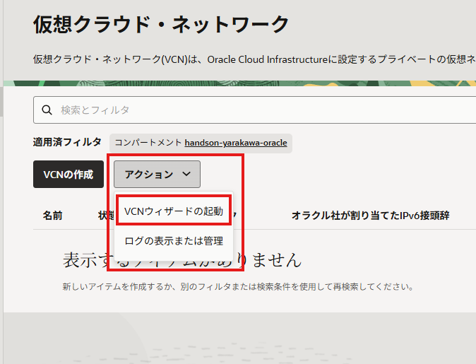
5. **インターネット接続性を持つVCNの作成**を選び、**VCNウィザードの起動**を選択します。
6. 基本情報の**VCN名**（例：vcn-名前）を入力します。
7. **コンパートメント**には割り当てられているコンパートメントが選択されていることを確認します。
8. **VCNの構成**以降はデフォルトとします。
9. パラメータシートのシート2に**VCN名**を記録します。
5. **次**をクリックします。**確認および作成**画面に表示される**パブリック・サブネット**の**サブネット名**をパラメータシートのシート2に記録します。
6. 右下の作成をクリックし、ウィザードの完了を待ちます。通常、1分程度で完了します。
7. 右下のVCNの表示をクリックします。
8. サブネットのタブをクリックして、作成されたパブリック・サブネットを開きます（名前は「パブリック・サブネット-VCN名」です）。
9. セキュリティのタブをクリックし、表示されたセキュリティ・リスト（Default Security List for VCN名）を開きます。
10. セキュリティ・ルールのタブを開きます。
11. **イングレス・ルールの追加** をクリックして、次のステートフル・イングレス・ルールを追加します。

| ソース・タイプ | ソースCIDR | IPプロトコル | 宛先ポート | 用途 |
|---|---|---|---|---|
|CIDR| `<管理端末の接続元CIDR>` | TCP | 8080 |Private  Agent FactoryのHTTPSエンドポイント |

※ソース・ポート範囲は空のままにします。

12. **イングレス・ルールの追加** をクリックします。

13. イングレス・ルールに、今設定した宛先ポートが8080のルールが追加されていることを確認します。

14. エグレス・ルールで、宛先が`0.0.0.0/0`のすべてのプロトコルの通信が許可されていることも確認します。

> **このハンズオンの設計判断：** ブラウザからAgent Factoryコンソールへアクセスするため、ポート8080だけを開放します。VMへSSH接続しないため、ポート22は不要です。ハンズオン後もVMを継続利用し、OS更新や障害調査のためにSSH接続する場合は、その時点で管理端末のCIDRからポート22へのアクセスを追加してください。`0.0.0.0/0`には開放しません。

なお、ポート22を開放しない場合も、MarketplaceインストーラーにはED25519公開鍵の入力が必要です。ED25519公開鍵は後の手順で作成します。

Marketplaceの公式ガイドでは、参照構成としてポート1521のイングレス・ルールも挙げています。今回の構成では、VMからパブリックなAutonomous AI Databaseへ接続するため、Agent Factory VMへの1521イングレスは不要です。このサブネット内で別のコンポーネントがデータベース接続を待ち受ける場合を除き、開放しないでください。

> **ハンズオン環境のセキュリティ：** Marketplaceの公式例は、ポート22、8080、1521を`0.0.0.0/0`から許可します。本記事との差分と理由は上記のとおりです。プライベート・サブネットでSSH保守が必要な場合はOCI Bastionを検討し、組織のネットワーク・ポリシーを優先してください。

**公式ドキュメント**

- [Virtual Networking Wizards — Create a VCN with Internet Connectivity](https://docs.oracle.com/en-us/iaas/Content/Network/Tasks/quickstartnetworking.htm)
- [Agent Factory Installation from OCI Marketplace — Prerequisites](https://docs.oracle.com/en/database/oracle/agent-factory/26.7/paias/install-oci-marketplace.html#GUID-D3E77E92-4967-4C20-B9DA-4C2D3B319AB4)


### Task 2：パブリックなAutonomous AI Database 26aiを作成する

1. **Oracle AI Database > Autonomous AI Database**を開きます。
2. リージョンを確認し、**適用済みフィルタ コンパートメント**で割当済みコンパートメントを選択します。
3. **Autonomous AI Databaseの作成**をクリックします。
4. 表示名（例：paf-adb）を入力し、パラメータシートのシート2に記録します。
  表示名は、一意でなくてもよい。１～255文字。英字、数字、アンダースコア（_）、ハイフン（-）。ただし連続ハイフンは不可。先頭は英字かアンダースコア。
5. データベース名（例：PAFDB名前）を入力し、パラメータシートのシート2に記録します。
  データベース名は、英字で始まる30文字以内の英数字。テナンシ内で一意。すべて大文字。
5. **ワークロード・タイプ**は**トランザクション処理**を選択します。
6. データベースの構成のAlways Free と 開発者 はデフォルトのオフのままとします。
7. **データベース・バージョンの選択** は**26ai**を選択します。
8. 予期しない利用量と料金の増加を避けるため、**自動スケーリングの計算**はこのハンズオンでは**無効**とします。今後も継続利用する場合は、有効にしても構いません。
9. ECPU数はデフォルトの **2 ECPU** のままとします。
9. ストレージは **150 GB** とします。
10. 管理者資格証明の作成で、`ADMIN`の**パスワード（例：Welcome12345#）** を設定します。パラメータシートのシート2に記録します。
11. ネットワーク・アクセスで**すべての場所からのセキュア・アクセス**を選択します。このハンズオンの前提であるパブリック・エンドポイントが作られます。
12. 暗号化、バックアップ、タグ、連絡先などに組織固有の要件がなければ、その他の設定はハンズオン用のデフォルト値のままにします。
13. **作成**をクリックします。
14. 状態が「プロビジョニング中」から**使用可能**に変わるまで待ちます。通常1分程度で完了します。

**公式ドキュメント**

- [Provision an Autonomous AI Database Instance — Steps 1–11](https://docs.oracle.com/en/cloud/paas/autonomous-database/serverless/adbsb/autonomous-provision.html)
- [About Network Access Options — Secure access from everywhere](https://docs.oracle.com/en/cloud/paas/autonomous-database/serverless/adbsb/network-access-options.html)


### Task 3：Private Agent Factory専用のデータベース・ユーザーを作成する

1. 作成したADBの画面上部にある**データベース・アクション > SQL**を開きます。
2. ブラウザの別タブが開きます。右上の人型アイコンの右に表示されているユーザーを見て、`ADMIN`として自動的にサインインしたことを確認します。
3. ガイダンスと警告の右上の「X」をクリックして閉じます。
2. 下記のSQLをワークシートに貼り付けます。各SQL文の`<DB_USER>`をPrivate Agent Factory用のユーザー名（例：PAFUSER）で置き換えます（計6カ所）。`<DB_PASSWORD>`も適切なパスワード（例：Welcome12345#）で置き換えます（計2カ所）なお、パスワードは作成する2つのユーザーで同じパスワードである必要があります。
ユーザー名とパスワードをパラメータシートのシート2のAgent Factory用DBユーザー名とAgent Factory用DBユーザーのパスワードに記録します。

```sql
CREATE USER <DB_USER> IDENTIFIED BY <DB_PASSWORD>
  DEFAULT TABLESPACE USERS QUOTA UNLIMITED ON USERS;

GRANT CREATE SESSION, CREATE TABLE, CREATE SEQUENCE, CREATE TRIGGER,
      CREATE TYPE, CREATE PROCEDURE, CREATE VIEW, CREATE SYNONYM
  TO <DB_USER>;

GRANT READ, WRITE ON DIRECTORY DATA_PUMP_DIR TO <DB_USER>;
GRANT SELECT ON SYS.V_$PARAMETER TO <DB_USER>;

CREATE USER AAI_RO_<DB_USER>
  IDENTIFIED BY <DB_PASSWORD> ACCOUNT UNLOCK;
GRANT CREATE SESSION TO AAI_RO_<DB_USER>;
```

ユーザーとパスワードを例にとおりとする場合は以下の SQLスクリプトとなります。

```sql:ユーザーとパスワードを例にとおりとする場合
CREATE USER PAFUSER IDENTIFIED BY Welcome12345#
  DEFAULT TABLESPACE USERS QUOTA UNLIMITED ON USERS;

GRANT CREATE SESSION, CREATE TABLE, CREATE SEQUENCE, CREATE TRIGGER,
      CREATE TYPE, CREATE PROCEDURE, CREATE VIEW, CREATE SYNONYM
  TO PAFUSER;

GRANT READ, WRITE ON DIRECTORY DATA_PUMP_DIR TO PAFUSER;
GRANT SELECT ON SYS.V_$PARAMETER TO PAFUSER;

CREATE USER AAI_RO_PAFUSER
  IDENTIFIED BY Welcome12345#;
GRANT CREATE SESSION TO AAI_RO_PAFUSER;
```


3. 画面上部の **スクリプトの実行ボタン（再生ボタンのような▷の右隣）** をクリックして、6つのSQLを実行します。

4. スクリプト出力のタブで6つのSQLが正常終了することを確認します。これでPrivate Agent Factory用の2つのユーザーが作成されます。

スクリプト出力タブに以下のように出力されます。

```text:出力例

User PAFUSERは作成されました。

経過時間: 00:00:00.183


Grantが正常に実行されました。

経過時間: 00:00:00.008


Grantが正常に実行されました。

経過時間: 00:00:00.016


Grantが正常に実行されました。

経過時間: 00:00:00.011


User AAI_RO_PAFUSERは作成されました。

経過時間: 00:00:00.130


Grantが正常に実行されました。

経過時間: 00:00:00.004

```

> Autonomous AI Databaseでは、`SYS.V_$PARAMETER`を指定します。旧版の`V$PARAMETER`は使いません。

**公式ドキュメント**

- [Installation from OCI Marketplace — Configure Application](https://docs.oracle.com/en/database/oracle/agent-factory/26.7/paias/install-oci-marketplace.html#GUID-D3E77E92-4967-4C20-B9DA-4C2D3B319AB4)

### Task 4：インスタンス・ウォレットをダウンロードする

1. 元のブラウザ・タブに戻り、作成したADBの画面の上部にある**データベース接続**を選択します。
2. **クライアント資格証明（ウォレット）のダウンロード**で、**インスタンス・ウォレット**を選びます。Oracleは、アプリケーション用途にはインスタンス・ウォレットを推奨しています。リージョナル・ウォレットは、複数のADBを扱う管理用途向けです。
3. **ウォレットのダウンロード**を選択し、ウォレットのパスワード（例：Welcome12345#）を設定します。ウォレットZIPをローカルPCへ保存し、Excel版パラメータシートへファイルの保存先とパスワードを記録します。
4. 接続文字列内の末尾が`_tpurgent`の完全なデータベース・サービス別名を確認します。ADBは、データベース名を接頭辞とするTNS別名群を自動的に作成します。たとえば、データベース名が`PAFDB`なら`pafdb_tpurgent`です。
5. 表示された完全な別名を、そのままパラメータシートの`3_生成値_Generated`シートの`ADBのTNS別名`へ記録します。本ハンズオンでは、アプリケーションの低遅延化に推奨される`_tpurgent`を選びます。

6. 右下の **取消** をクリックしてデータベース接続画面を閉じます。

**公式ドキュメント**

- [Download Database Connection Information — Download client credentials from the OCI Console](https://docs.oracle.com/en/cloud/paas/autonomous-database/serverless/adbsb/connect-download-wallet.html)
- [Database Service Names for Autonomous AI Database](https://docs.oracle.com/en-us/iaas/autonomous-database-serverless/doc/predefined-database-services-names.html)
- [Installation from OCI Marketplace — Configure Database Connection](https://docs.oracle.com/en/database/oracle/agent-factory/26.7/paias/install-oci-marketplace.html)

## Lab 1：Private Agent Factory 26.7をデプロイして初期設定する

Lab 0で用意したネットワーク、ウォレット、データベース資格証明と、作業前に用意したOCI認証情報を使います。このLabを終えると、管理者でPrivate Agent Factoryへサインインし、生成モデル（LLM）を呼び出せる状態になります。

### Task 1：ED25519鍵を作成し、OCI Marketplaceスタックで Private Agent Factory をデプロイする

#### ローカルPCでED25519鍵ペアを作成する

Marketplaceデプロイでは、ED25519公開鍵の入力が必要です（このハンズオンでは、SSHは使用しませんが、インストーラーに渡す必要があります）。使用しているOSに合わせて、ローカルPCで鍵ペアを作成します。

以下は、ssh-keygen を使って鍵ペアを生成する例です。**Tera Term** などで作成することもできます。鍵の種類として ED25519 を選択してください。

##### Windowsの場合

1. PowerShellを開き、`ssh-keygen`を利用できることを確認します。

```powershell
Get-Command ssh-keygen
```
出力例（ssh-keygen がインストールされている場合）
```terminal
PS C:\Users\user1\handson> Get-Command ssh-keygen

CommandType     Name                                               Version    Source
-----------     ----                                               -------    ------
Application     ssh-keygen.exe                                     9.5.6.2    C:\windows\System32\OpenSSH\ssh-keygen.exe
```

コマンドが見つからない場合は、PowerShellを管理者として開き、OpenSSHクライアントをインストールします。完了後、PowerShellを開き直してください。

```powershell
Add-WindowsCapability -Online -Name OpenSSH.Client~~~~0.0.1.0
```

2. カレント・ディレクトリに同名の鍵がないことを確認して、次のコマンドを実行します。

```powershell
ssh-keygen -t ed25519 -f .\paf_marketplace_ed25519
```

プロンプトが表示されたら秘密鍵のパスフレーズを設定します。作成された秘密鍵`paf_marketplace_ed25519`と公開鍵`paf_marketplace_ed25519.pub`の保存先をExcel版パラメータシートへ記録し、秘密鍵は他人と共有しないでください。

##### macOSまたはLinuxの場合

1. ターミナルを開き、カレント・ディレクトリに同名の鍵がないことを確認して、次のコマンドを実行します。

```bash
ssh-keygen -t ed25519 -f ./paf_marketplace_ed25519
```

プロンプトが表示されたら秘密鍵のパスフレーズを設定します。作成された秘密鍵`paf_marketplace_ed25519`と公開鍵`paf_marketplace_ed25519.pub`の保存先をExcel版パラメータシートへ記録し、秘密鍵は他人と共有しないでください。

> **インストーラーへ入力する鍵：** 公開鍵`paf_marketplace_ed25519.pub`だけを入力（あるいはアップロード）します。秘密鍵は貼り付けたり、他の人と共有したりしないでください。

> **秘密鍵を使う場面：** このハンズオンのPAFコンソール操作では使いません。ハンズオン後もVMを残し、SSHでOS更新や障害調査を行う場合に、VMへ登録した公開鍵と対になる秘密鍵を使います。

#### Marketplaceスタックを起動する

1. [Oracle AI Database Private Agent FactoryのMarketplace](https://marketplace.oracle.com/app/agentfactory)を開きます。

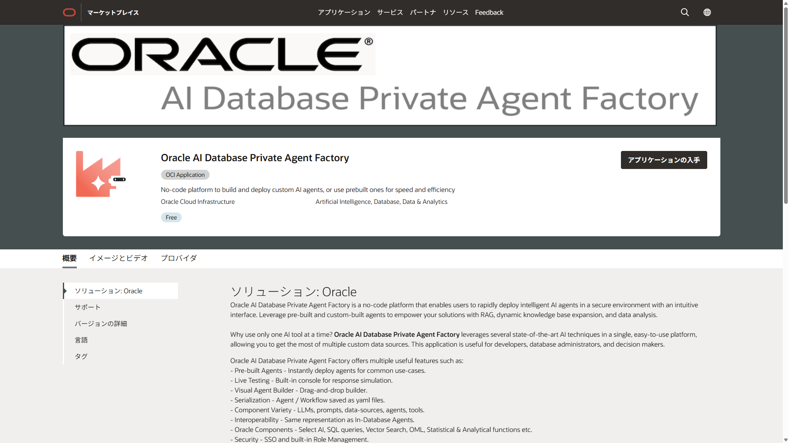


2. **アプリケーションの入手**を選択してOCIへサインインします（既にサインインしている場合は、スタックの起動画面に直接遷移します）。**リージョン**（例： US Midwest(Chicago)）と製品情報（アプリケーションの名前が **Oracle AI Database Private Agent Factory** となっていること）を確認し、**スタックの起動**を選択します（スタックとは、Resource Manager（Terraform）のデプロイ定義一式のことです。）、

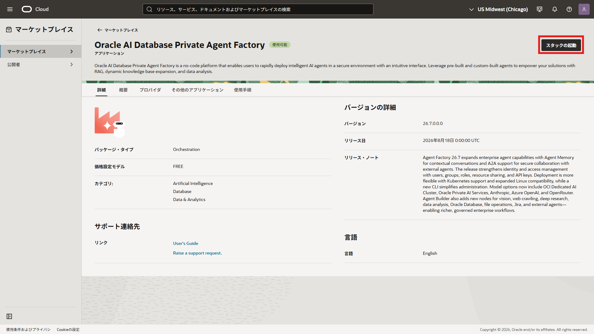

3. **Compartment** で割り当てられているコンパートメントが選択されていることを確認します。
4. **Version** が **26.7系**であることを確認します。このハンズオンガイドは26.7を前提としています。

5. 使用条件を？マークをクリックして確認し、同意される場合は、**I have reviewed and accept the Publisher terms and conditions** （使用条件）にチェックを入れます。

5. 右下の**スタックの起動**を選択します。前画面で選択したコンパートメントにResource Managerスタックが作成されます。


6. **スタックの作成**の**スタック情報**で、スタックの**名前** と **説明** を設定または確認します（表示されているデフォルトのままでも問題ありません）。

7. **Next** をクリックします。


8. **変数の構成** の **Compute Instance for Private Agent Factory Container**で、次の項目を設定します。
   - **Compute Compartment**（VMを配置するコンパートメント）：割当済みコンパートメント
   - **Availability Domain**（可用性ドメイン）：一覧に表示された任意の可用性ドメイン。
   - **Compute shape**（VMシェイプ）：デフォルトの VM.Standard.E5.Flex など
   - **OCPUs**（VM OCPU数）：4（x86シェイプでは8 CPUコア相当）
   - **Memory in GB**（VMメモリー）：32 GB
   - **Increase boot volume in GB**（VMブート・ボリューム）：150 GB
   - **SSH public key**（SSH公開キー）：`paf_marketplace_ed25519.pub`をアップロードする。秘密鍵はアップロードしない。公開鍵の保存場所はワークシートのシート2のメモを確認。
9. **Network for Compute and Database Connectivity**で、次の項目を設定します。
   - **VCN compartment** で、Lab 0でVCNを作成した際に指定したのコンパートメント（パラメータシートのシート1の割当済みコンパートメント名）
   - **Existing VCN**で、Lab 0 で作成した VCN（パラメータシートのシート2）
   - **Existing subnet**で、**パブリック・サブネット**を選択します（パラメータシートのシート2のパブリック・サブネット名を参照）。パブリックサブネットは一覧の最下部に表示されます。上に表示されるプライベートサブネットと間違えないようにしまし。

10. **Next** をクリックします。


11. **作成** をクリックします。


12. ジョブの詳細画面の**状態**が**成功**になるまで待ちます。通常、1～2分程度で完了します。


13. ブラウザを**リロード** して、ジョブの**Output**タブを開き、`Agent_Factory_URL`をコピーします（右端の **・・・** をクリックして **Copy** をクリック）。


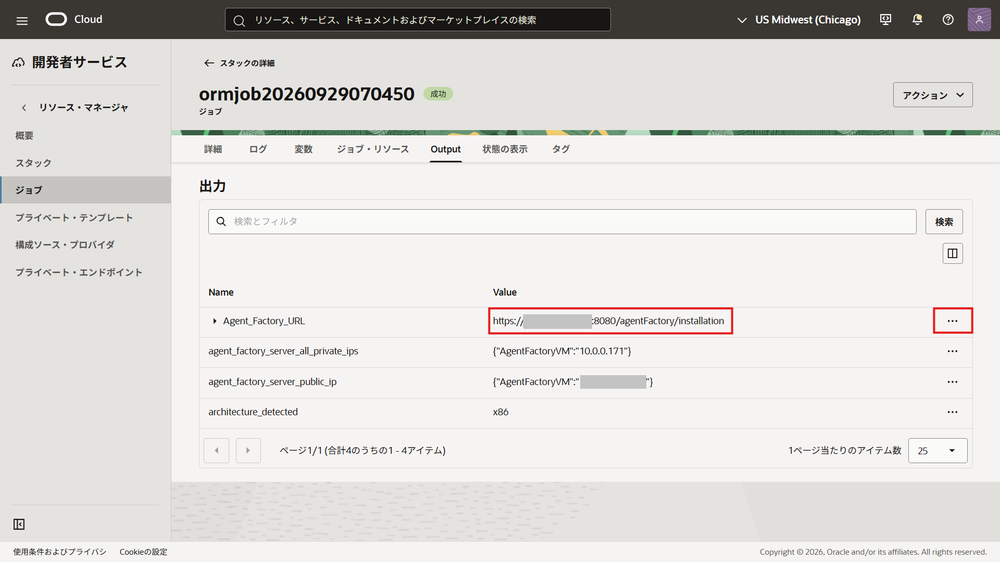

**`Agent_Factory_URL` の例**
```text
https://<instance_public_ip>:8080/agentFactory/installation
```

パラメータシートのシート3の Agent Factory URL に記録します。

**公式ドキュメント**

- [Installation from OCI Marketplace — Launch Stack](https://docs.oracle.com/en/database/oracle/agent-factory/26.7/paias/install-oci-marketplace.html#GUID-D3E77E92-4967-4C20-B9DA-4C2D3B319AB4)
- [Installation from OCI Marketplace — Security and Operational Requirements](https://docs.oracle.com/en/database/oracle/agent-factory/26.7/paias/install-oci-marketplace.html)
- [Connecting to a Linux Instance — OpenSSH clients on Windows, macOS, and Linux](https://docs.oracle.com/en-us/iaas/Content/Compute/Tasks/connect-to-linux-instance.htm)
- [Creating an Instance — Add SSH Keys (Linux)](https://docs.oracle.com/en-us/iaas/Content/Compute/Tasks/launchinginstance.htm)
- [Managing Key Pairs on Linux Instances](https://docs.oracle.com/en-us/iaas/Content/Compute/Tasks/managingkeypairs.htm)


### Task 2：Private Agent Factory初回セットアップ（初期設定）

1. パラメータシートに記録した`Agent Factory URL`を開きます。Marketplaceイメージはデフォルトで自己署名証明書を使うため、ブラウザに警告が出ることがあります。このハンズオンでは接続先ホストを確認してから先へ進みます。

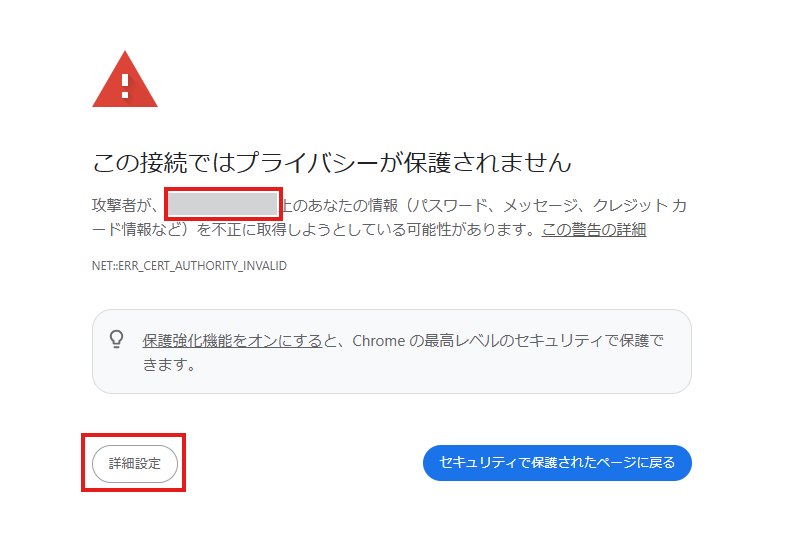

本番環境では、組織で承認された証明書に置き換えてください（[Manage Inbound Certificates](https://docs.oracle.com/en/database/oracle/agent-factory/26.7/paias/import-certificates.html#manage-inbound-certificates)）。
2. メールアドレスとパスワード（例：Welcome12345#）を、画面へ入力してAgent Factory管理者を作成します。Excel版パラメータシートのシート2のAgent Factory管理者のメールアドレスとAgent Factory管理者のパスワードに記録します。

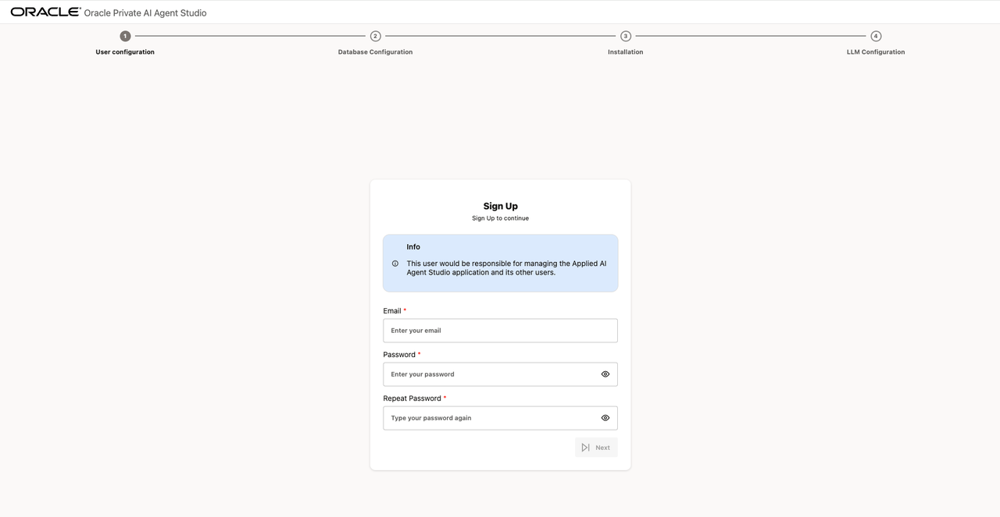

3. **Database Configuration**（データベース設定）の **Connection type** （接続の種類）で **Wallet**（ウォレット）を選び、ADBからダウンロードしたウォレットZIP（保存先はパラメータシートのシート2）をそのままアップロードします。

4. **Database service alias**（データベースサービス別名）は、プルダウンの候補からパラメータシートのシート3に記録したADBのTNS別名（例：`pafdb_tpurgent`）を選択します。

5. **User name** と**Password** にパラメータシートのシート2へ記録したAgent Factory用DBユーザー名（例：`PAFUSER`）と、そのパスワード（例：Welcome12345#）を入力します。

4. **Is your database server deployed in an air-gapped environment (no access to the public internet)?** では、**No** を選択します。このハンズオンでは、インターネットから接続できるパブリック・エンドポイントのADBを使い、閉域・エアギャップ環境として構成していないためです。

5. 続いて表示される**Are the OCI certificates added to the wallet?**では、**No**を選択します。追加のOCI証明書が必要なのは、Agent Factoryのドキュメントに関する質問へ回答するオプションの**Oracle AI Database Private Agent Factory Knowledge Assistant**を導入する場合だけです。このハンズオンでは導入しません。Lab 2で作成する通常のKnowledge Agentには影響しません。

6. **Test Connection**を選択します。**Database connection successful**と表示されたら、**Next**へ進みます。（`ORA-01017`というエラーが出た場合は、User name と Password を再確認してください。）

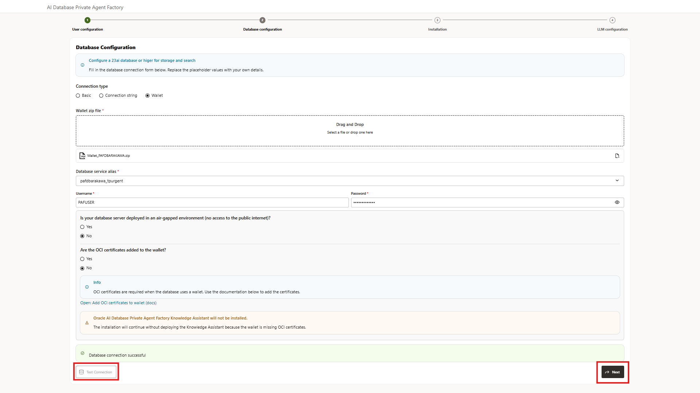

7. **+Install**を選択し、コンポーネントのインストールが終わるまで待ちます（通常5分程度で完了します）。


8. **Install**のスピナーが停止し、**Installation Log**の最後にLLM設定へ進むよう案内する**Please proceed to the next step for LLM Configuration**と表示されたら、**Next**を選択します。

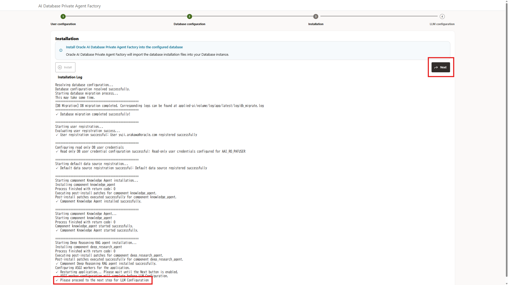

8. LLM Configuration画面で **Generative model**を次のように設定します。
   - **Configuration name**（構成名）：例えば、**oci_grok43**
   - **LLM provider**（LLMプロバイダ）：**OCI GenAI**
   - **Serving mode**（サービング・モード）：**On-demand**
   - **Authentication**（OCIの認証モード）：**API Key**
   - **Model ID**（LLMのモデルID）：パラメータシートのシート1の生成モデルID。例えば、**xai.grok-4.3**
   - **Endpoint**（サービス・エンドポイント）：パラメータシートのシート1のOCI Generative AIのサービス・エンドポイント。例えば、**https://inference.generativeai.us-chicago-1.oci.oraclecloud.com** （OCI GenAIのエンドポイントが`us-chicago-1`の場合）
   - **Compartment ID**（コンパートメントOCID）：パラメータシートのシート1の割当済みコンパートメントOCID
   - **User**（ユーザーOCID）：パラメータシートのシート1のOCIユーザーOCID
   - **Finger Print**（フィンガープリント）：パラメータシートのシート1のOCI APIキーのフィンガープリント
   - **Tenancy**（テナンシOCID）：パラメータシートのシート1のテナンシOCID
   - **Region**（リージョン）：パラメータシートのシート1のOCIリージョン。今回は、**us-chicago-1**。
   - **Key File**（OCI API署名用PEM秘密キー・ファイル）：パラメータシートのシート1のOCI API署名用PEM秘密キーの保存先の秘密鍵ファイル。公開キーやED25519秘密鍵ではありません
9. **Test connection**をクリックして接続テストを実行します。**Connection successful**と表示されたら、**Save Configuration**を選択します。

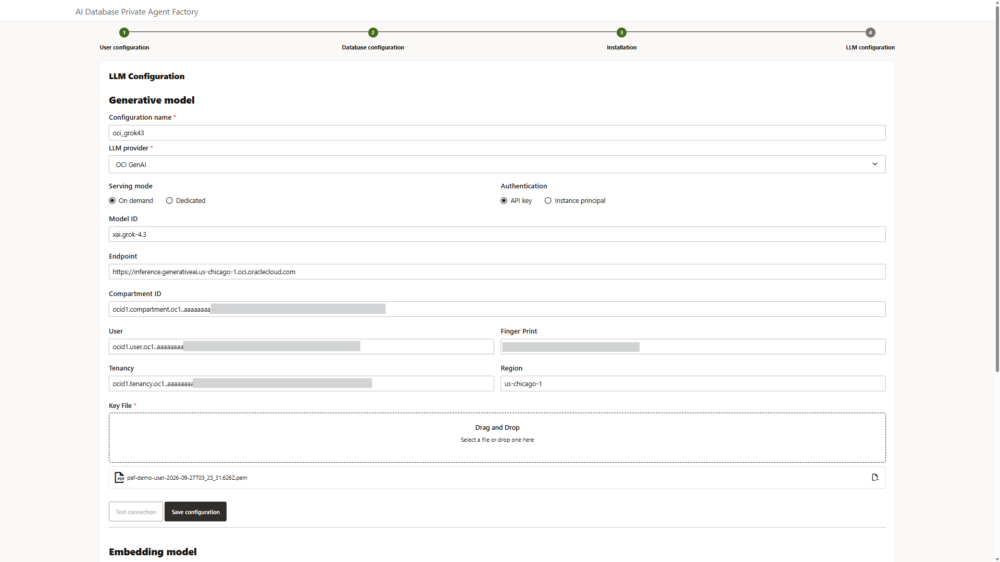

10. LLM Configuration画面で **Embedding model**を次のように設定します。
   - **Configuration name**（構成名）：例えば、**cohere-embed4**
   - **Embedding provider**（埋込みモデル・プロバイダ）：**OCI GenAI**
   - **Authentication**（OCIの認証モード）：**API Key**
   - **Model ID**（埋込みモデルID）：今回のハンズオンでは、**cohere.embed-v4.0**
   - **Endpoint**（サービス・エンドポイント）：パラメータシートのシート1のOCI Generative AIのサービス・エンドポイント。例えば、 **https://inference.generativeai.us-chicago-1.oci.oraclecloud.com** （OCI GenAIのエンドポイントが`us-chicago-1`の場合）
   - **Compartment ID**（コンパートメントOCID）：パラメータシートのシート1の割当済みコンパートメントOCID
   - **User**（ユーザーOCID）：パラメータシートのシート1のOCIユーザーOCID
   - **Finger Print**（フィンガープリント）：パラメータシートのシート1のOCI APIキーのフィンガープリント
   - **Tenancy**（テナンシOCID）：パラメータシートのシート1のテナンシOCID
   - **Region**（リージョン）：パラメータシートのシート1のOCIリージョン。今回は、**us-chicago-1**。
   - **Key File**（OCI API署名用PEM秘密キー・ファイル）：パラメータシートのシート1のOCI API署名用PEM秘密キーの保存先の秘密鍵ファイル。公開キーやED25519秘密鍵ではありません
11. **Test connection**をクリックして接続テストを実行します。**Connection successful**と表示されたら、**Save Configuration**を選択します。


12. **Finish Installation**を選択し、作成した管理者アカウント（パラメータシートのシート2 のAgent Factory管理者のメールアドレス）でサインインします。
> **Generative model** と **Embedding model** のそれぞれの**Save Configuration** ボタンをクリックして設定を保存する必要があります。両方を保存完了すると **Finish Installation** ボタンが有効になります。

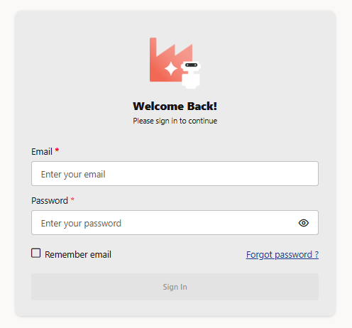
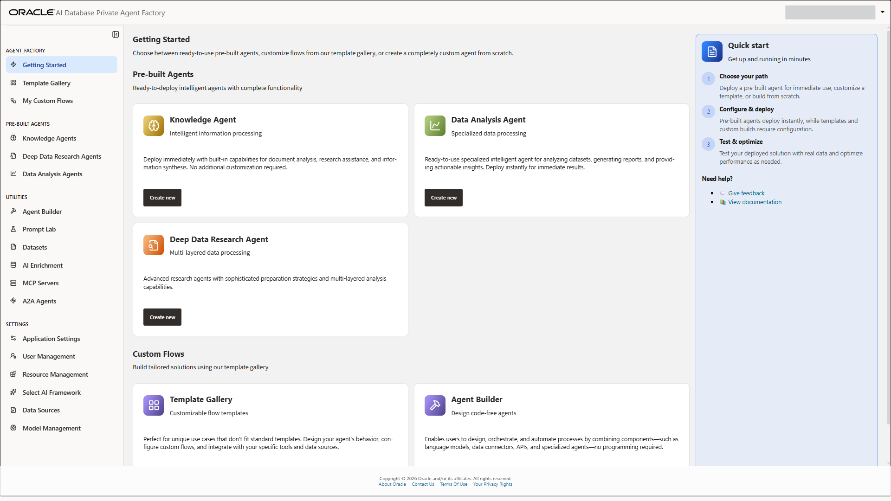

**公式ドキュメント**

- [Installation from OCI Marketplace — Configure Application](https://docs.oracle.com/en/database/oracle/agent-factory/26.7/paias/install-oci-marketplace.html#GUID-D3E77E92-4967-4C20-B9DA-4C2D3B319AB4)
- [Set Up Agent Factory on Linux — Configure Database Connection](https://docs.oracle.com/en/database/oracle/agent-factory/26.7/paias/setup-linux.html#GUID-E01E8EC6-F59C-49E2-8B33-29543C2C4628)
- [Configure LLM — OCI Generative AI, On-demand](https://docs.oracle.com/en/database/oracle/agent-factory/26.7/paias/llm-management.html)
- [Managing User Credentials — Working with Console Passwords and API Keys](https://docs.oracle.com/en-us/iaas/Content/Identity/Tasks/managingcredentials.htm)
- [xAI Grok 4.3 — Access this Model / On-Demand Mode](https://docs.oracle.com/en-us/iaas/Content/generative-ai/xai-grok-4-3.htm)
- [Generative AI Models by Region — North America / External Calls to xAI Grok Models](https://docs.oracle.com/en-us/iaas/Content/generative-ai/model-endpoint-regions.htm)


## Lab 2：Pre-builtエージェントを作成する

Agent Factoryへ管理者またはEditorとしてサインインします。このLabでは、構造化データ用のData Analysis Agentと、文書検索用のKnowledge Agentを1つずつ公開します。

### Task 1：Movies Datasetサンプルを使ってData Analysis Agentを作成する

1. 左側メニューの **UTILITY** の **Datasets**を開き、**Movies Dataset** の **Import Dataset** をクリックしてインポートします。右上の **Refresh** をときどきクリックして画面を更新し、ステータスが**Imported**になるまで待ちます。通常、1分程度で完了します。

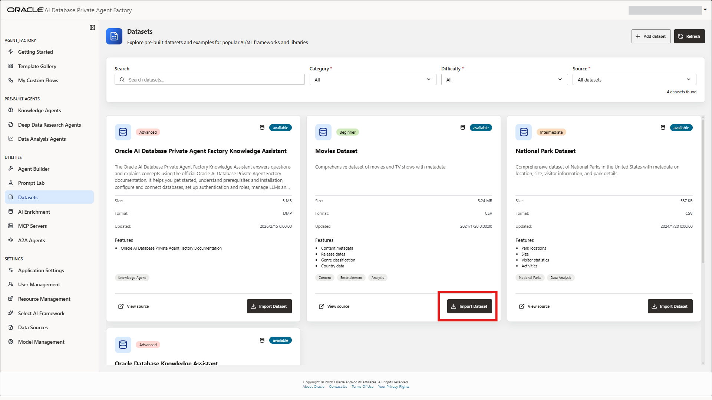

2. 左側メニューの **PRE-BUILT AGENTS** の **Data Analysis Agents**を開き、**Create Agent**を選択します。

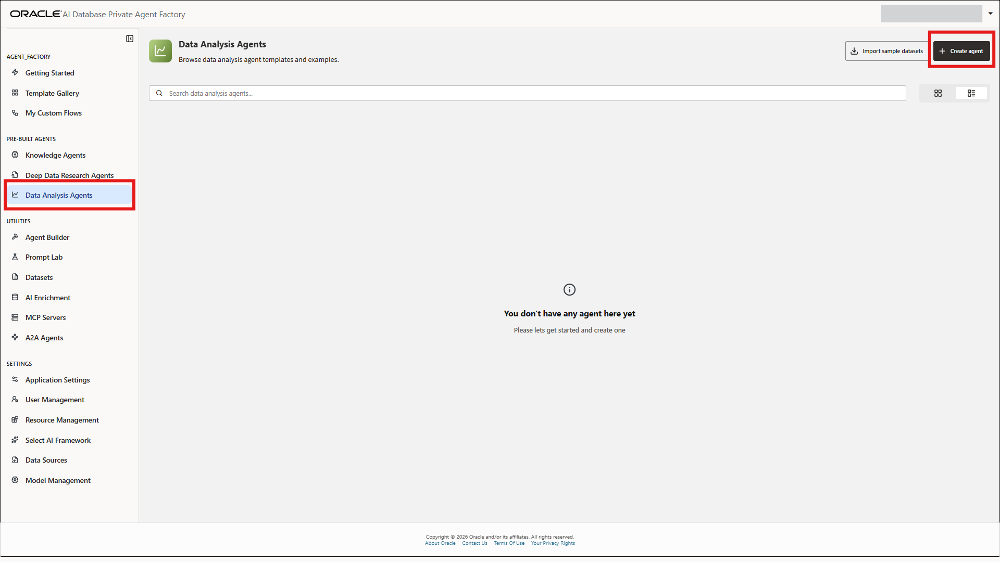

3. **Database \* (select one)** で、**Applied AI Datasets**データベースを選択します。

4. **Views / Tables \* (select one)** で、**Movies Dataset**を選び、**Next**をクリックします。

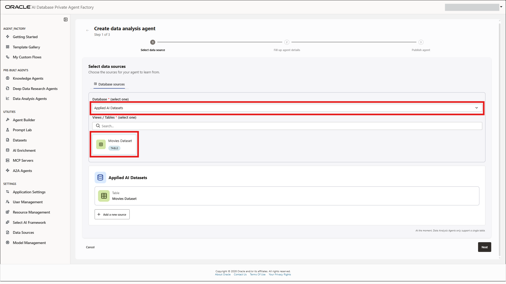

5. **Data analysis configuration** の **Agent name**にエージェントの名前（例：Movie Data Analysis Agent）を入力します（**Agent name**には英数字のみ使用できます）。

6. **Description**にエージェントの説明（例：映画情報の構造化データを使ってユーザーの質問に答えるエージェント）を入力します（**Description**には日本語を使用できます）。

ヘルプに表示する**Help Description**は任意です。

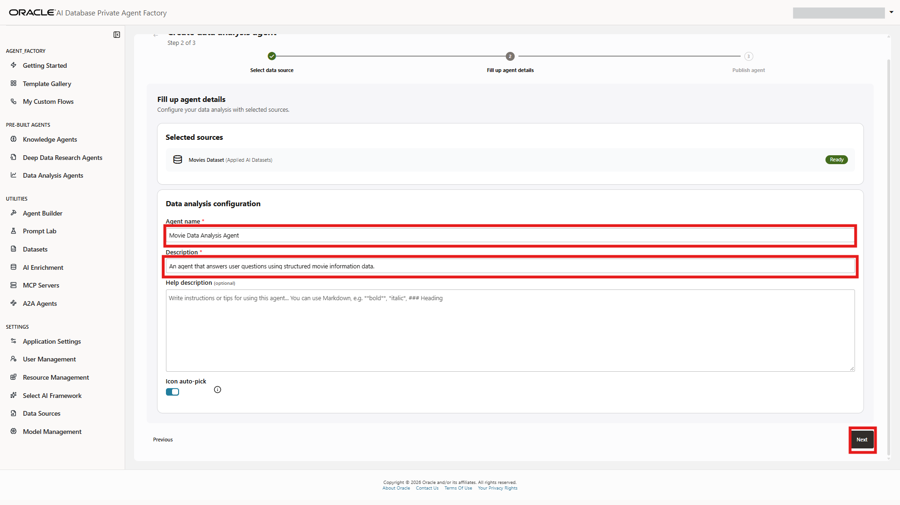

7. **Next** をクリックします。

8. **Publish agent** をクリックして、エージェントを公開します。


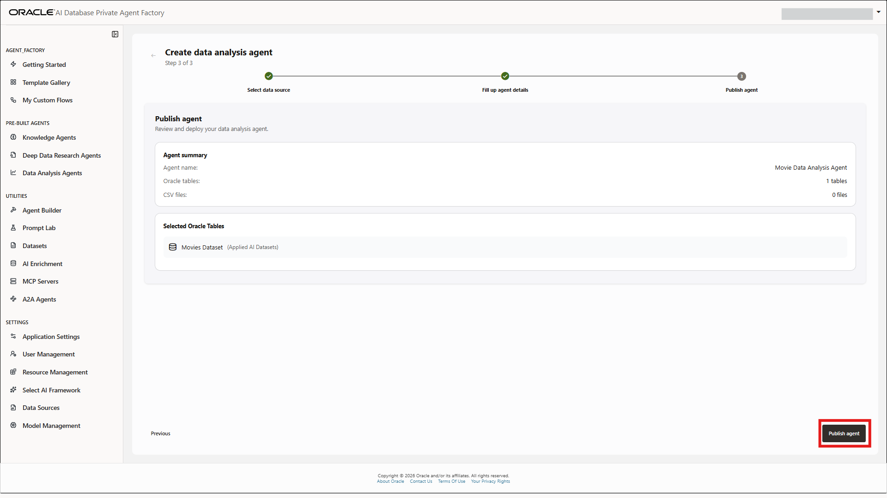

9. **Open Agent**を選択します。
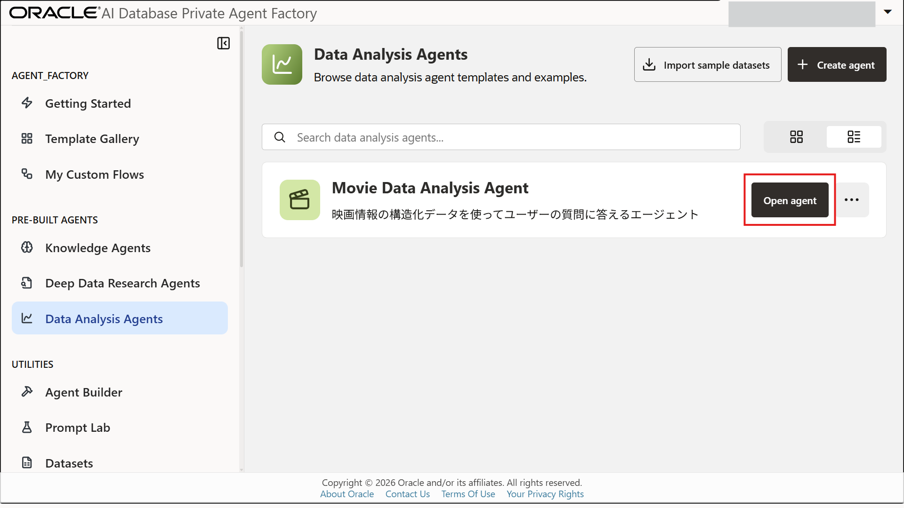

初回のチャットではデータの探索が実行され、質問例が表示されます。1分程度時間がかかります。

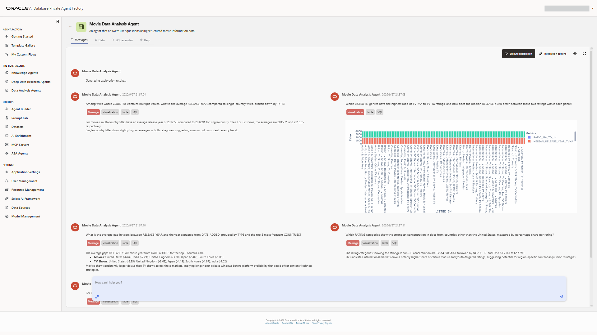

10. `どの公開年の作品数が最も多いですか`などと質問します。**Message**を選択すると自然言語による回答、**Table**を選択すると表形式での回答、**SQL**を選択すると実行されたSQLが表示されます。

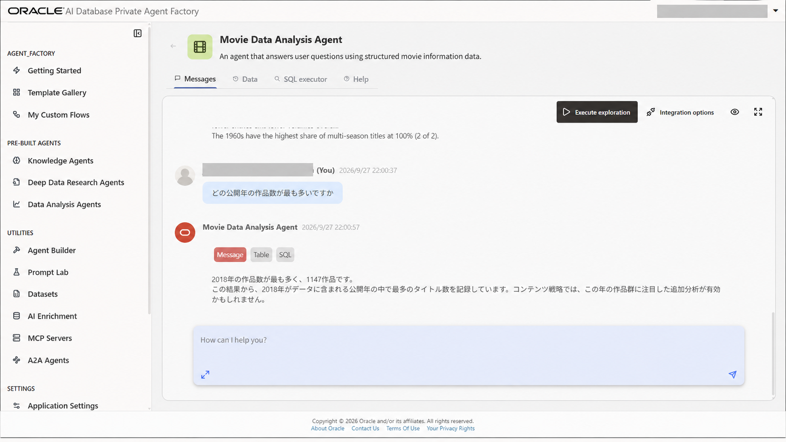

**公式ドキュメント**

- [Data Analysis Agents — Create a Data Analysis Agent](https://docs.oracle.com/en/database/oracle/agent-factory/26.7/paias/create-data-analysis-agent.html)
- [Use Datasets — Import a Dataset / Use an Imported Dataset](https://docs.oracle.com/en/database/oracle/agent-factory/26.7/paias/use-datasets.html)

### Task 2：PDFからKnowledge Agentを作成する

1. PDFを用意します。Agent Factory 26.7のFile Sourceでは、`.pdf`、`.txt`、`.pptx`、`.doc`、`.docx`形式のファイルを1ファイルあたり最大1 GBまで扱えます。Markdownは取り込めません。例えば、[日本オラクル有価証券報告書](https://www.oracle.com/jp/a/ocom/docs/jp-investor-relations/fy26-yuho-jp.pdf) をダウンロードしておきます。
2. 左側メニューの **Settings**の**Data Sources**を開いて**File sources**タブを選び、**Add data source**をクリックします。

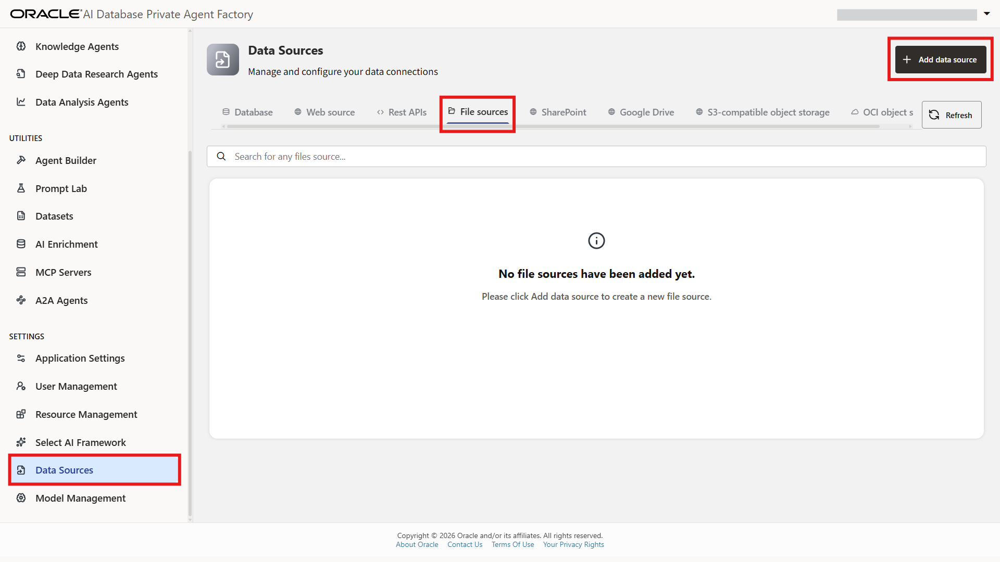
3. **Source Type**が**File Source**となっていることを確認します。**Source name**にドキュメントのタイトル（例：Nihon Oracle Report）、**Description**に説明（例：日本オラクルの有価証券報告書）を入力し、**Upload files from your system**にPDFをアップロードします。**Add file source**をクリックしてデータソースを作成します。
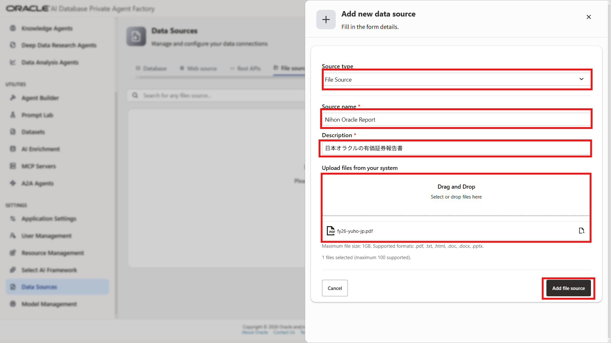
4. データソースを作成すると、データ処理が始まります。クロール、解析、格納、チャンク分割、埋込み、取り込みが完了するまで待ちます。**Status**が**uploaded**になれば完了です。例の有価証券報告書の場合は十秒程度で完了します。**All files uploaded**ダイアログを閉じます。
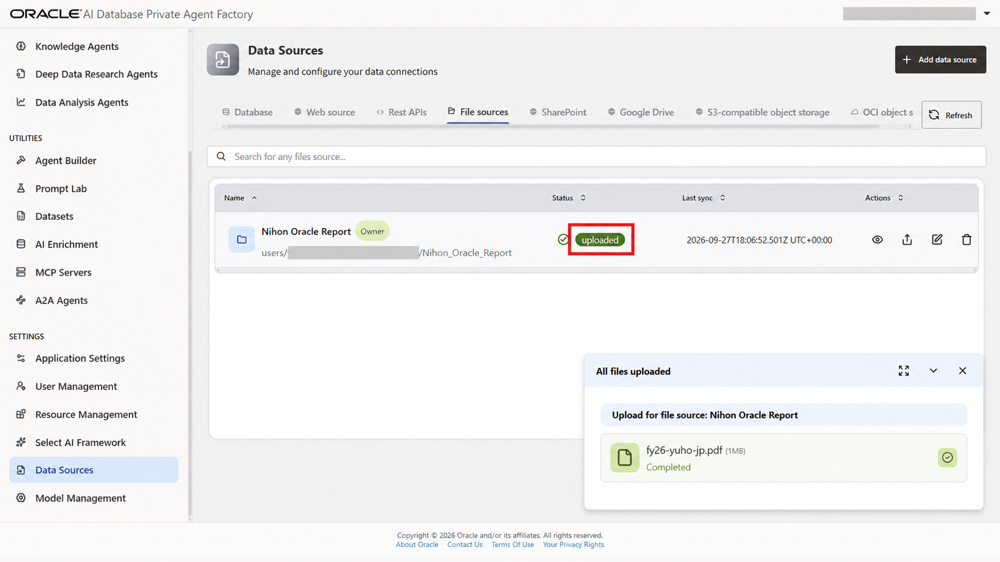

5. 左側メニューの**PRE-BUILT AGENTS**の**Knowledge Agents**を開き、**Create Agent**を選択します。

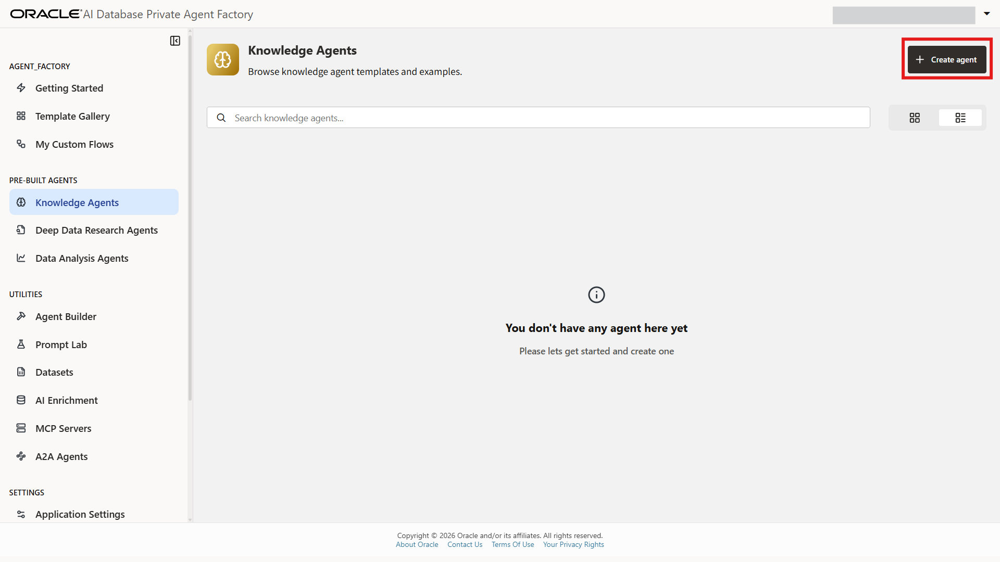

6. **Select data sources**の**File system**タブを選択し、取り込み済みのFile Sourceにチェックを入れます。**Next**をクリックします。
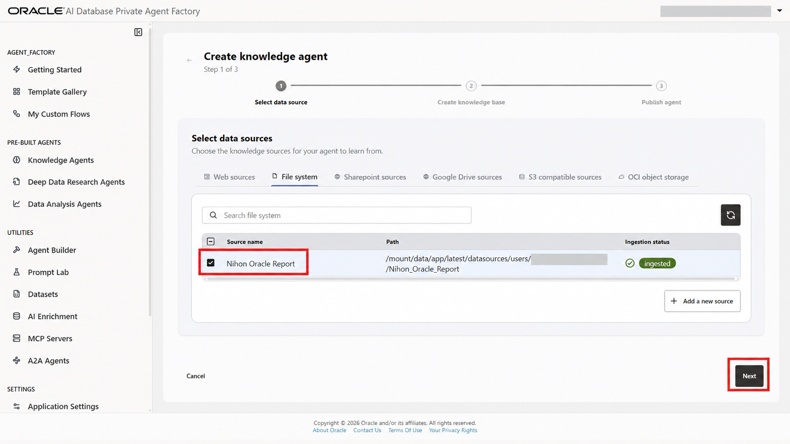

7. **Knowledge base configuration**の**Agent name**にエージェントの名前（例：Nihon-Oracle-Report）、**Description**にエージェントの詳細な説明（例：日本オラクルの有価証券報告書の内容について質問に答えるエージェント）を入力します。構成済みの生成モデル（例：oci_grok43）を選択します。生成モデルは作成後も変更できます。**Help description**（ヘルプに表示する説明文）は任意です。**Next**をクリックします。

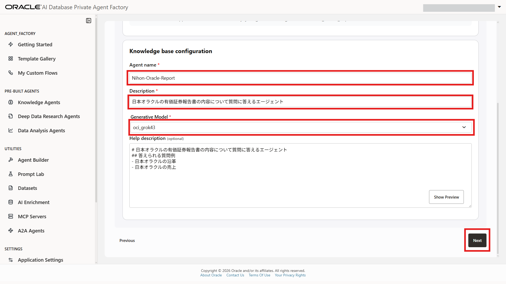
8. **Publish agent**をクリックして、エージェントを公開します。
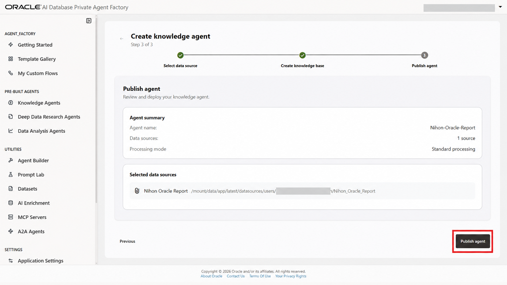

9. 作成したエージェントの**Open agent**をクリックしてエージェントを開きます。
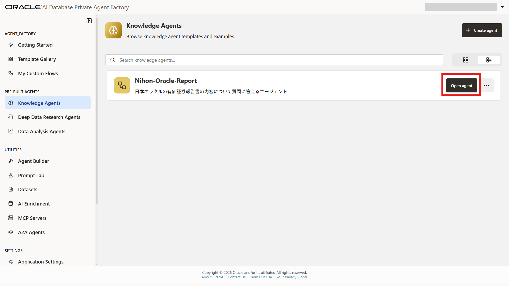

10. PDFの内容に関連する質問を入力します（例：日本オラクルの事業分野は？）。

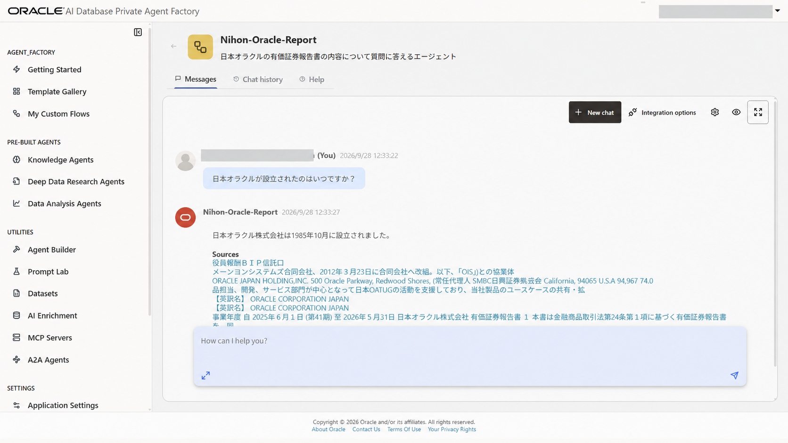

**公式ドキュメント**

- [Knowledge Agents — Create a Knowledge Agent](https://docs.oracle.com/en/database/oracle/agent-factory/26.7/paias/create-knowledge-agent.html)
- [File Data Source — File Data Source](https://docs.oracle.com/en/database/oracle/agent-factory/26.7/paias/file-source.html)


## 後片付けと運用上の注意

ハンズオン終了後は、組織またはリソース所有者が定めるリソースの保持方針に従います。

- 開発者サービス > リソース・マネージャ > スタック で表示されるスタック一覧から Private Agent Factory をデプロイしたスタックをクリックして開き、
右上のアクションから破棄を選択
- Oracle AI Database > Autonomous AI Database で表示されるデータベース一覧から Private Agent Factory 用にデプロイしたデータベースをクリックして開き、右上のその他アクションから終了を選択


MarketplaceのVMは利用者の管理対象です。製品上の問題は、組織のOracleサポート窓口からサービス・リクエストを登録してください。ハンズオンの環境や権限に関する問題は、演習担当者またはテナンシ管理者へ連絡します。

製品の使い方は、[Agent Factory 26.7 User's Guide](https://docs.oracle.com/en/database/oracle/agent-factory/26.7/paias/introduction.html)で確認できます。インストール媒体は[公式ダウンロード・ページ](https://www.oracle.com/database/technologies/private-agent-factory-downloads.html)、OCIへのデプロイは[OCI Marketplace掲載ページ](https://marketplace.oracle.com/app/agentfactory)を参照してください。

## Appendix A：ハンズオン用リソースを作成せずにOCI権限を確認し、不足分を付与する

### 参加者は所属グループとAPIキーを確認し、管理者へ権限照合を依頼する

OCIには、あるユーザーに実際に適用される権限を自動集計して表示する標準画面やAPIはありません。同じユーザーが複数のグループから許可を得ることがあります。親コンパートメントに置かれたポリシーの継承、各ポリシー文の条件、テナンシでオプトイン有効化されている場合のDeny（拒否）ポリシーも判定に影響します。このため、参加者は所属グループを確認し、ポリシーを参照できる管理者へ、どのポリシー文が適用されるかの評価を依頼します。

1. OCIコンソール右上の**プロファイル**・メニューから**My profile**を開きます。
2. **My groups**タブを選び、所属グループを記録します。自動的に所属する`All-Domain-Users`は、この一覧に表示されないことがあります。
3. 使用するアイデンティティ・ドメイン名、ユーザー名、リージョン、割当済みコンパートメントの名前とOCIDを記録します。
4. **My profile**で、Lab 1のTask 2に使うOCI API署名キーとフィンガープリントを確認します。APIキーを表示または追加できない場合は、その旨も管理者へ伝えます。
5. テナンシ管理者へ、記録した情報と次の確認表を渡します。参加者にポリシーの参照権限がない場合、この確認は管理者が行う必要があります。

通常、OCI API署名キーは各ユーザーが**My profile**から管理できます。ただし、SCIMなどでプロビジョニングされたフェデレーテッド・ユーザーには、追加の許可が必要な場合があります。

#### 管理者に確認してもらう項目

| ハンズオンの操作 | 管理者が確認する主な許可 |
|---|---|
| VCN、サブネット、ルート、セキュリティ・リストの作成 | 対象コンパートメントの`manage virtual-network-family` |
| MarketplaceからVMとブート・ボリュームを作成 | 対象コンパートメントの`manage instance-family`、`use volume-family`、`manage app-catalog-listing` |
| Autonomous AI Databaseの作成とウォレット取得 | 対象コンパートメントの`manage autonomous-database-family` |
| Resource Managerスタックの作成と実行 | `manage orm-stacks`、ジョブ情報を参照する`read orm-jobs`、PLAN・APPLYジョブを実行できる条件付き`manage orm-jobs` |
| `xai.grok-4.3`の選択と呼び出し | `inspect generative-ai-model`、`inspect generative-ai-endpoint`、対象モデルに対する`use generative-ai-chat` |

コンソールで各サービスの一覧を表示できても、通常、確認できるのは`inspect`または`read`相当の権限です。作成権限があることの証明にはなりません。IAM権限がそろっていても、次の要因で作成が拒否されることがあります。

- サービス制限とコンパートメントの割当て（クォータ）
- リージョンのキャパシティ
- DenyポリシーとSecurity Zone
- 定義済みタグの要件

管理者は、確認結果として次の情報を参加者へ返します。

- 参加者が所属するアイデンティティ・ドメインとグループ
- 参加者に適用されるポリシー名と、そのポリシーが置かれているコンパートメント
- 対象コンパートメント名とOCID
- 下記の例と同等の既存または新規のポリシー文
- ハンズオンの操作を妨げるDenyポリシーや条件がないこと
- サービス制限、割当て（クォータ）、Security Zone、タグ・デフォルトの確認結果
- 参加者が所属するほかのグループから、生成AI推論を無条件またはより広い範囲で許可されていないこと

既存のグループとポリシーですべての要件を満たしていれば、追加設定は不要です。不足がある場合だけ、次の手順へ進みます。

### 管理者は不足時だけ専用グループとポリシーを設定する

次の例では、リソース管理権限とMarketplaceのサブスクリプション管理をハンズオン専用コンパートメントに限定します。これはサービス単位の実用的な権限例であり、API操作単位まで権限を最小化した例ではありません。既存の本番コンパートメントには適用しないでください。組織ですでにグループや同等のポリシーを管理している場合は、新しいものを重複して作らず、不足分だけを追加します。

1. **アイデンティティとセキュリティ > ドメイン**を開き、参加者が所属するアイデンティティ・ドメインを選択します。
2. 新しい専用グループが必要な場合は、**グループ > グループの作成**を選び、例として`PAFWorkshopUsers`を作成します。同等の既存グループを使う場合は、この手順を省略します。
3. 使用するグループを開き、参加者が所属していなければ、**ユーザーをグループに追加**から追加します。外部IdPでユーザーを管理している場合は、組織の既存手順に従ってIdPグループを対応するOCIグループへマップします。
4. **アイデンティティとセキュリティ > ポリシー**を開きます。1つの専用ポリシーを新規作成する場合は、ハンズオン用コンパートメントを選択して**ポリシーの作成**を選びます。既存ポリシーを使う場合は、適用範囲を確認し、不足する文だけを追加します。
5. 新しい専用ポリシーには、以下の全カテゴリを入力します。既存ポリシーを補う場合は、不足するカテゴリまたはポリシー文だけを追加してください。プレースホルダーは実際の値へ置き換えます。`<genai-compartment-ocid>`には生成AIモデルを使用するコンパートメントのOCIDを指定します。ハンズオン用コンパートメントと同じ場合は、同じOCIDを指定します。

#### Step 5：用途別のポリシー文

##### コンパートメントを一覧から選択する

```text
Allow group <identity-domain>/<group-name> to inspect compartments in tenancy
```

- `inspect compartments`：テナンシのコンパートメント名、OCID、階層を一覧で確認できます。この情報を使って、OCIコンソールで作業対象を選択します。

##### Marketplace掲載情報を参照し、利用条件へ同意する

```text
Allow group <identity-domain>/<group-name> to manage app-catalog-listing in compartment id <workshop-compartment-ocid>
```

- `manage app-catalog-listing`：対象コンパートメントで、Marketplaceの掲載内容の参照、利用条件への同意、サブスクリプションの管理を許可します。スタックの起動には、後述するVCN、VM、ボリューム、Resource Managerの権限も必要です。

##### VCN、VM、ブート・ボリュームを管理する

```text
Allow group <identity-domain>/<group-name> to manage virtual-network-family in compartment id <workshop-compartment-ocid>
Allow group <identity-domain>/<group-name> to manage instance-family in compartment id <workshop-compartment-ocid>
Allow group <identity-domain>/<group-name> to use volume-family in compartment id <workshop-compartment-ocid>
```

- `manage virtual-network-family`：対象コンパートメント内のVCN、サブネット、ルート表、インターネット・ゲートウェイ、セキュリティ・リストなどを作成・更新・削除できます。
- `manage instance-family`：対象コンパートメント内のすべてのコンピュート・インスタンス、インスタンス・イメージ、ボリューム・アタッチメントなどを管理できます。このハンズオンでは、Agent Factory VMの作成と管理に使います。
- `use volume-family`：対象コンパートメント内の既存ボリュームを利用できます。`manage instance-family`と組み合わせることで、VMの起動やボリュームのアタッチ、デタッチが可能になります。

##### Autonomous AI Databaseを管理する

```text
Allow group <identity-domain>/<group-name> to manage autonomous-database-family in compartment id <workshop-compartment-ocid>
```

- `manage autonomous-database-family`：対象コンパートメント内で、Autonomous AI Databaseの作成・更新・停止・削除と、ウォレットの取得に必要な操作を実行できます。

##### Resource Managerスタックを実行する

```text
Allow group <identity-domain>/<group-name> to manage orm-stacks in compartment id <workshop-compartment-ocid>
Allow group <identity-domain>/<group-name> to read orm-jobs in compartment id <workshop-compartment-ocid>
Allow group <identity-domain>/<group-name> to manage orm-jobs in compartment id <workshop-compartment-ocid> where any {target.job.operation = 'PLAN', target.job.operation = 'APPLY', target.job.operation = 'DESTROY'}
```

- `manage orm-stacks`：対象コンパートメント内のResource Managerスタックを作成・更新・移動・削除できます。このハンズオンでは、Marketplaceから作成するスタックの管理に使います。
- `read orm-jobs`：対象コンパートメント内のジョブ一覧、詳細、ログ、Terraform構成、状態ファイルを参照できます。構成や状態ファイルには機密情報が含まれる場合があります。
- 条件付きの`manage orm-jobs`：対象コンパートメント内で、PLAN、APPLY、DESTROYの各ジョブを実行できます。参加者が後片付けをしない場合は`DESTROY`を外せます。Marketplaceスタックの起動だけであれば、PLANとAPPLYで足ります。

##### `xai.grok-4.3`を選択して呼び出す

```text
Allow group <identity-domain>/<group-name> to inspect generative-ai-model in compartment id <genai-compartment-ocid>
Allow group <identity-domain>/<group-name> to inspect generative-ai-endpoint in compartment id <genai-compartment-ocid>
Allow group <identity-domain>/<group-name> to use generative-ai-chat in compartment id <genai-compartment-ocid> where target.model.id = 'xai.grok-4.3'
```

- `inspect generative-ai-model`：対象の生成AIコンパートメント内で`ListModels`を実行し、選択できるモデルを一覧表示できます。
- `inspect generative-ai-endpoint`：対象の生成AIコンパートメント内で`ListEndpoints`を実行し、生成AIエンドポイントを一覧表示できます。OCI Generative AIのChat Playgroundでは、この権限がないとモデル一覧の読み込みに失敗することを実機で確認しています。このハンズオンでは、モデル選択時の一覧取得に備えて付与します。
- 条件付きの`use generative-ai-chat`：対象の生成AIコンパートメント内で、`xai.grok-4.3`を指定したChat APIの呼び出しだけを許可します。モデルやエンドポイントが一覧に表示されても、この条件で許可されていないモデルは呼び出せません。

6. 新しいポリシーを作成するか、既存ポリシーへの変更を保存します。対象アイデンティティ・ドメインのホーム・リージョンでは通常10秒程度で反映されますが、ほかのリージョンへの反映には数分かかることがあります。`NotAuthorized`が返る場合は、反映を待ってから再試行します。
7. 参加者は、**My groups**に使用するグループが表示されることを確認します。管理者はポリシー詳細を開き、グループ、各コンパートメントOCID、モデルIDが正しいことを再確認します。
8. テナンシでDenyポリシーを使用している場合は、今回の操作を拒否するポリシー文がないことを確認します。また、参加者が所属するすべてのグループを調べ、`xai.grok-4.3`以外も許可する生成AI推論権限がないことを確認します。OCIの許可は累積するため、別のグループによる広い許可があると、モデルIDの条件だけでは利用モデルを限定できません。
9. **制限、割当ておよび使用状況**で、コンピュート、ADB、VCNのサービス制限と割当て（クォータ）を確認します。

IAM権限と、それ以外の制約を確認できたら、Lab 0へ進みます。未解決の項目があれば、演習担当者またはテナンシ管理者へ連絡してください。

**参加者向け公式ドキュメント**

- [Viewing Your Group Access — My groups](https://docs.oracle.com/en-us/iaas/Content/Identity/usersettings/view-group-access.htm)
- [Managing Groups — All-Domain-Users](https://docs.oracle.com/en-us/iaas/Content/Identity/groups/managinggroups.htm)
- [Managing User Credentials — API signing keys](https://docs.oracle.com/en-us/iaas/Content/Identity/Tasks/managingcredentials.htm)

**管理者向け公式ドキュメント**

- [Managing Policies — Working with Policies / Policy Builder](https://docs.oracle.com/en-us/iaas/Content/Identity/Tasks/managingpolicies.htm)
- [Permissions — Understanding a User's Access](https://docs.oracle.com/en-us/iaas/Content/Identity/policies/permissions.htm)
- [Managing Groups — Create a group / Add a user to a group](https://docs.oracle.com/en-us/iaas/Content/Identity/Tasks/managinggroups.htm)
- [Deny Policies — opt-in and evaluation](https://docs.oracle.com/en-us/iaas/Content/Identity/policysyntax/denypolicies.htm)
- [Required IAM Policy to Access Marketplace](https://docs.oracle.com/en-us/iaas/Content/Marketplace/Tasks/view-applications-iam-policy.htm)
- [Details for the Core Services — Networking, Compute, and Block Volume](https://docs.oracle.com/en-us/iaas/Content/Identity/Reference/corepolicyreference.htm)
- [Securing Resource Manager — Manage Stacks and Jobs](https://docs.oracle.com/en-us/iaas/Content/Security/Reference/resourcemanager_security.htm)
- [IAM Policies for Autonomous AI Database — Required IAM Policies](https://docs.oracle.com/en-us/iaas/autonomous-database-serverless/doc/autonomous-database-iam-policies.html)
- [Models, Clusters, and Keys — API Permissions](https://docs.oracle.com/en-us/iaas/Content/generative-ai/model-permissions.htm)
- [API-Level Permissions for Endpoints — Inspect Permission](https://docs.oracle.com/en-us/iaas/Content/generative-ai/endpoint-permissions.htm)
- [Limiting Model Inference Access with IAM Policies — Allow Inference Access to Specific Models](https://docs.oracle.com/en-us/iaas/Content/generative-ai/limit-model-access.htm)

**動作確認例**

- [OCI Enterprise AI（Generative AI）で利用できるモデルをIAMポリシーで制限してみる](https://qiita.com/yuji-arakawa/items/2d49b6e23cdf45fc22d6)


<!-- 26.7更新: リソース作成を伴わない権限確認の限界、My groupsによる所属確認、管理者による適用ポリシー監査、専用グループ作成、Marketplace・Resource Manager・Compute・VCN・ADB・xai.grok-4.3向けの実用的な権限例をAppendix Aへ追加。ED25519鍵はローカルPCで作成するためCloud Shell権限は不要。OCIではグループに適用される全ポリシーを自動取得できないため、継承・条件・累積する許可・Denyを含めて管理者が確認する。根拠: https://docs.oracle.com/en-us/iaas/Content/Identity/Tasks/managingpolicies.htm 「Working with Policies」、https://docs.oracle.com/en-us/iaas/Content/Identity/policies/permissions.htm 「Understanding a User's Access」、https://docs.oracle.com/en-us/iaas/Content/Identity/policysyntax/denypolicies.htm 「Deny Policies」、https://docs.oracle.com/en-us/iaas/Content/Marketplace/Tasks/view-applications-iam-policy.htm 「Required IAM Policy to Access Marketplace」、https://docs.oracle.com/en-us/iaas/Content/Security/Reference/resourcemanager_security.htm 「Manage Stacks and Jobs」、https://docs.oracle.com/en-us/iaas/autonomous-database-serverless/doc/autonomous-database-iam-policies.html 「Required IAM Policies」、https://docs.oracle.com/en-us/iaas/Content/generative-ai/limit-model-access.htm 「Allow Inference Access to Specific Models」。 -->

**最終確認日：** 2026年9月25日。Agent Factory 26.7の公式ドキュメントと照合済み。
